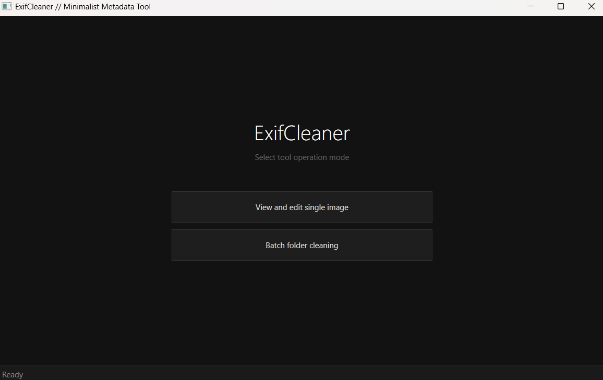
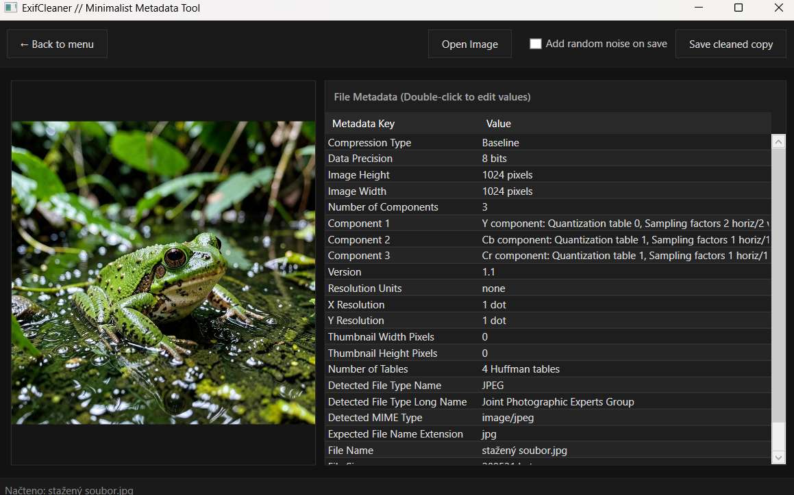
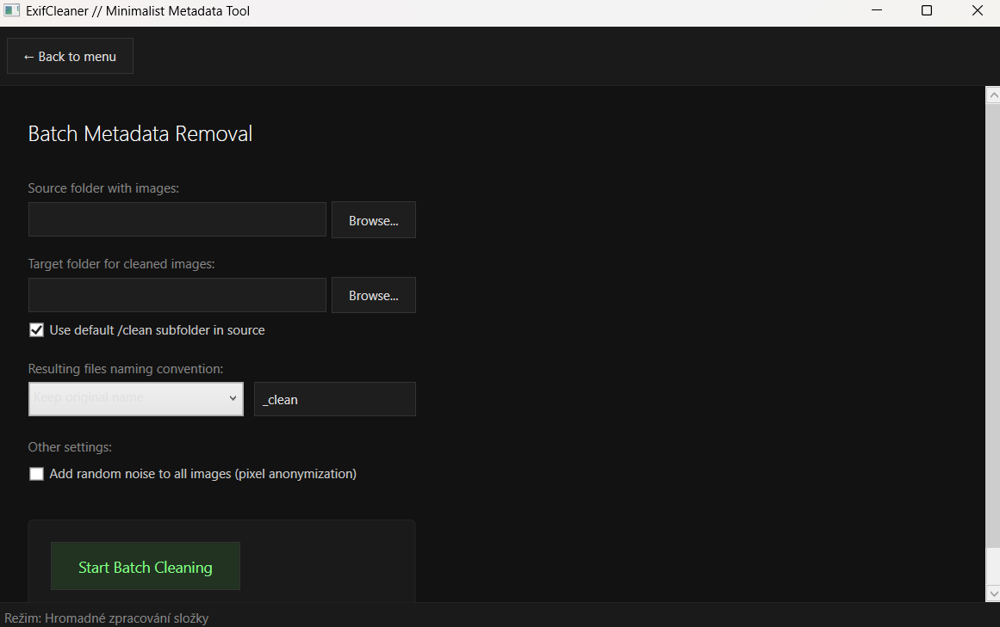

# ExifCleaner

**ExifCleaner** is a minimalist WPF utility designed to view, inspect, and safely strip metadata from images, with an optional feature to anonymize image files using imperceptible digital noise.

---

## Key Features

- **Format Support:** Seamlessly handles JPEG, PNG, BMP, and TIFF files.
- **Metadata Inspection:** View extensive image metadata tags (EXIF, IPTC, XMP) in an organized data grid.
- **Metadata Stripping:** Save a 100% clean copy of your image with all tracking, location, and camera data removed.
- **Pixel Anonymization:** Optionally inject a subtle, visually unnoticeable random noise to scramble the digital sensor fingerprint.
- **Batch Processing:** Clean entire directories at once with custom output folder routing and flexible file renaming options.

---

## Screenshots

### 1. Operation Hub (Main Menu)

Select your preferred workflow right from the launch screen.

### 2. Single Image Mode

Inspect specific metadata keys and save a single anonymized copy.

### 3. Batch Processing

Clean hundreds of photos simultaneously with progress tracking and custom naming rules.

---

## Usage

1. **Launch the application** and choose your mode from the main menu.
2. **Single Mode:**
   - Click **Open Image** to load a photo.
   - Inspect the metadata keys and values in the grid.
   - Check **Add random noise on save** if you want to alter the pixel fingerprint.
   - Click **Save cleaned copy** to output the cleared file.
3. **Batch Mode:**
   - Select your **Source folder** containing the images.
   - Choose a **Target folder** or keep the default automatic `/clean` subfolder.
   - Configure your preferred naming convention (Keep original, Suffix, or Prefix).
   - Click **Start Batch Cleaning** and monitor the live progress bar.

> **Note on JPEGs:** When saving, JPEG files are re-compressed at approximately 75% quality to eliminate hidden markers, which might result in a slightly smaller file size than the original.
